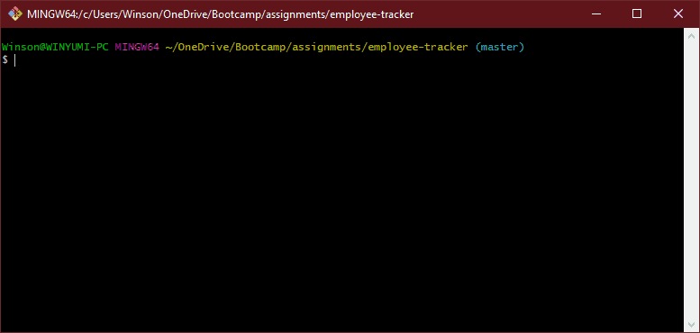

# Employee Tracker

## Introduction

Managing the employees in a company does not come easy as the company grows larger. Use this app to perform simple tasks to view, add, update, and remove employees, roles, and departments.

## Installation

**Note.js v13+** and **MySQL v8+** is required in order to run this script.

1. Download or clone this repository into your local computer.
2. In your MySQL client, log into your MySQL server.
3. Run the SQL query file `./db/schema.sql` to initialize the `employee_db` database. (Optional: Run `./db/seeds.sql` for sample data.)
4. In your terminal, browse to the folder and run `npm install --production`.
5. Edit the `./lib/env.js` file with your own credentials so the app can connect to your MySQL server.

## Usage

1. In your terminal, run the script with the command `npm start` or `node server.js`.
2. You will be given multiple menu options to view, add, update, and remove employees, roles, and departments.
3. You will be prompted with a confirmation at the end of every action you do just in case you change your mind.

## Preview

